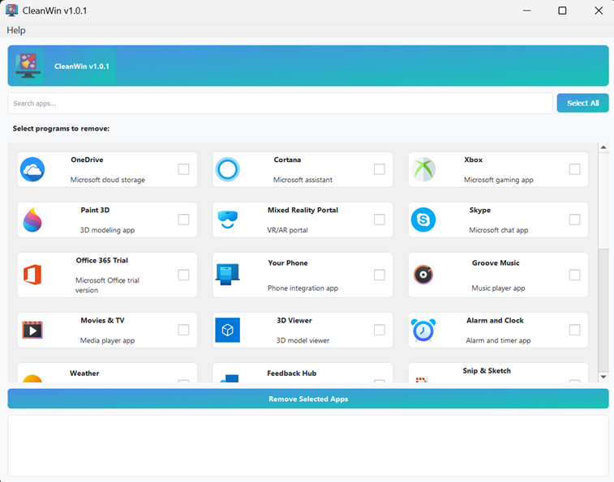
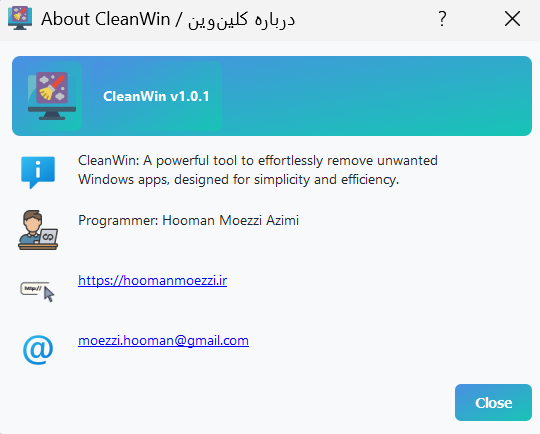

# CleanWin

CleanWin is a powerful tool to effortlessly remove unwanted Windows apps, designed for simplicity and efficiency. It supports both English and Persian languages with a user-friendly interface.

## Features
- Remove pre-installed Windows apps (e.g., Xbox, Cortana, OneDrive).
- 3-column grid layout with 28 custom app icons (48x48 pixels).
- Bilingual interface (English and Persian) with RTL support.
- Search functionality to filter apps.
- Lazy loading for faster UI performance.
- Requires admin privileges for app removal.

## Screenshots



## Installation
### Prerequisites
- Windows 10/11
- For development: Python 3.13+ and PyQt5 (`pip install PyQt5`)

### Steps
1. Clone the repository:
   ```bash
   git clone https://github.com/hooman2007/cleanwin.git
   cd cleanwin


Install dependencies (if running from source):pip install PyQt5


Run the app:python cleanwin.py


Download

Download the standalone executable from Releases.
Run CleanWin_v1.0.1.exe (requires admin privileges).

Building Executable
To create the standalone EXE:
pip install PyInstaller
pyinstaller --noconfirm --onefile --windowed --upx-dir "path/to/upx" --upx-exclude "vcruntime140.dll" --icon="icons/default.png" --add-data "icons;icons" --version-file "version.txt" --name CleanWinApp cleanwin.py

Usage

Select a language (English or Persian).
Choose apps to remove by checking the boxes.
Click "Remove Selected Apps" (requires admin privileges).
Restart your PC to apply changes.

License
MIT License
Author
Hooman Moezzi AzimiWebsite: hoomanmoezzi.irEmail: moezzi.hooman@gmail.com
© 2025 Hooman Moezzi Azimi